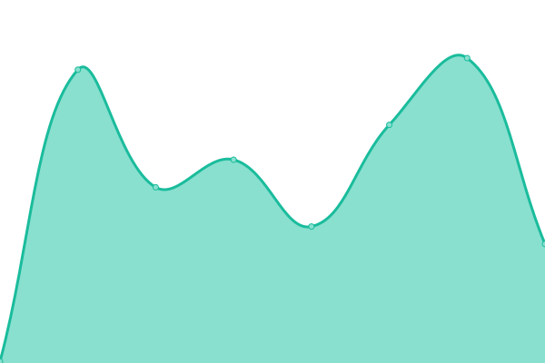

# [📈 Live Status](https://status.justinclicks.com): <!--live status--> **🟩 All systems operational**

This repository contains the open-source uptime monitor and status page for [JustInClicks.com](https://www.justinclicks.com), powered by [Upptime](https://github.com/upptime/upptime).

With [Upptime](https://upptime.js.org), you can get your own unlimited and free uptime monitor and status page, powered entirely by a GitHub repository. We use [Issues](https://github.com/JustInClicks-com/status.justinclicks.com/issues) as incident reports, [Actions](https://github.com/JustInClicks-com/status.justinclicks.com/actions) as uptime monitors, and [Pages](https://status.justinclicks.com) for the status page.

<!--start: status pages-->
<!-- This summary is generated by Upptime (https://github.com/upptime/upptime) -->
<!-- Do not edit this manually, your changes will be overwritten -->
<!-- prettier-ignore -->
| URL | Status | History | Response Time | Uptime |
| --- | ------ | ------- | ------------- | ------ |
|  [JustInClicks.com](https://www.justinclicks.com) | 🟩 Up | [just-in-clicks-com.yml](https://github.com/JustInClicks-com/status.justinclicks.com/commits/HEAD/history/just-in-clicks-com.yml) | 

 1591ms
     
 | 

<a href="https://status.justinclicks.com/history/just-in-clicks-com">100.00%</a>
    

|  [Bank API V1](https://bank-apis.justinclicks.com/API/V1/) | 🟩 Up | [bank-api-v1.yml](https://github.com/JustInClicks-com/status.justinclicks.com/commits/HEAD/history/bank-api-v1.yml) | 

 135ms
     
 | 

<a href="https://status.justinclicks.com/history/bank-api-v1">100.00%</a>
    

<!--end: status pages-->

[**Visit our status website →**](https://status.justinclicks.com)

## 📄 License

- Powered by: [Upptime](https://github.com/upptime/upptime)
- Code: [MIT](./LICENSE) © [JustInClicks.com](https://www.justinclicks.com)
- Data in the `./history` directory: [Open Database License](https://opendatacommons.org/licenses/odbl/1-0/)
